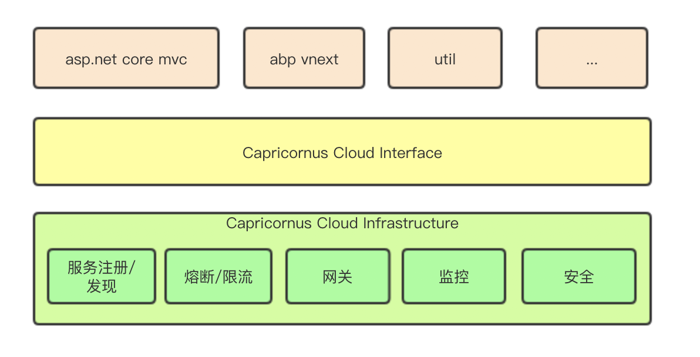

## What is the Capricornus Cloud
Capricornus Cloud provides tools for developers to quickly build distributed systems.

## Architecture

## What is the Capricornus Cloud want to do?
- Service Discovery
- Config Server
- Circuit Breaker
- Security Providers
- API Gateway
- Monitor